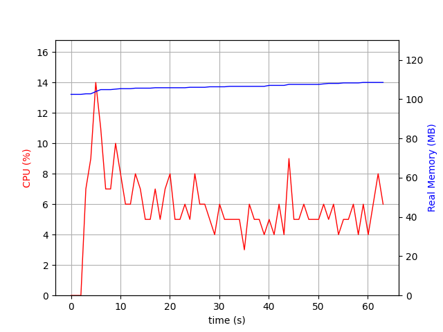
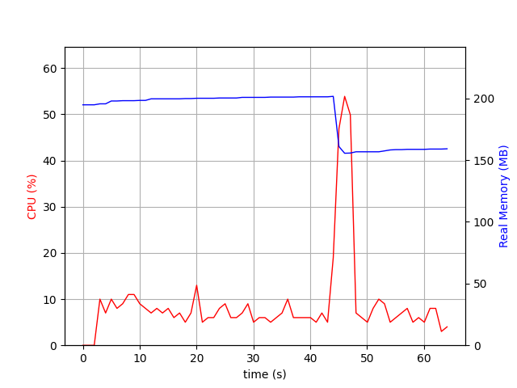

# General
Used RAML: [world-music-api](world-music-api)

NodeJS version: 13.5.0

All examples should be run from cloned github repos of `osprey` and `osprey-mock-service`.

# osprey

## Setup
To test Osprey from `master`, install it via npm:
```sh
cd ./app
npm install
npm install osprey
```

To test `osprey` from `rework_webapi_parser` branch, install it via Makefile and link it to osprey app:
```sh
make all
cd ./app
npm install
npm link path/to/cloned/osprey
```

Osprey app code can be found in [osprey-app.js](./src/osprey-app.js).

## Request/response time

### Setup
Installation:
```sh
sudo apt install apache2-utils
```

Start server with:
```sh
node osprey-app.js
```

Make requests and profile with (this makes 50000 requests with 10 concurrency):
```sh
ab -c 10 -n 50000 -H "Accept: application/json" -H "Authorization: qwe" "http://localhost:3000/songs?genre=foo&access_token=123"
```

### master
```
Document Path:          /songs?genre=foo&access_token=123
Document Length:        41 bytes

Concurrency Level:      10
Time taken for tests:   21.681 seconds
Complete requests:      50000
Failed requests:        0
Total transferred:      12400000 bytes
HTML transferred:       2050000 bytes
Requests per second:    2306.20 [#/sec] (mean)
Time per request:       4.336 [ms] (mean)
Time per request:       0.434 [ms] (mean, across all concurrent requests)
Transfer rate:          558.53 [Kbytes/sec] received

Connection Times (ms)
              min  mean[+/-sd] median   max
Connect:        0    0   0.0      0       1
Processing:     2    4   0.9      4      21
Waiting:        2    3   0.9      3      20
Total:          2    4   0.9      4      21

Percentage of the requests served within a certain time (ms)
  50%      4
  66%      4
  75%      4
  80%      5
  90%      5
  95%      6
  98%      7
  99%      8
 100%     21 (longest request)
```

### rework_webapi_parser
```
Document Path:          /songs?genre=foo&access_token=123
Document Length:        41 bytes

Concurrency Level:      10
Time taken for tests:   41.210 seconds
Complete requests:      50000
Failed requests:        0
Total transferred:      12400000 bytes
HTML transferred:       2050000 bytes
Requests per second:    1213.29 [#/sec] (mean)
Time per request:       8.242 [ms] (mean)
Time per request:       0.824 [ms] (mean, across all concurrent requests)
Transfer rate:          293.84 [Kbytes/sec] received

Connection Times (ms)
              min  mean[+/-sd] median   max
Connect:        0    0   0.1      0       9
Processing:     2    8   2.7      7     218
Waiting:        2    6   2.8      6     216
Total:          2    8   2.7      8     219

Percentage of the requests served within a certain time (ms)
  50%      8
  66%      8
  75%      8
  80%      8
  90%      9
  95%     11
  98%     14
  99%     18
 100%    219 (longest request)
```

## CPU and memory usage
### Setup
Installation:
```sh
sudo pip install psrecord
sudo apt-get install python-matplotlib python-tk
npm install -g artillery
```

In three different terminals:

1. Start server with:
```sh
node osprey-app.js
```

2. Start profiler:
```sh
psrecord $(pgrep node -n) --interval 1 --plot osprey.png
```

3. Start `artillery` to generate requests:
```sh
artillery run osprey.yml
```

When `artillery` finishes making requests, switch to the tab with the profiler running, press `Ctrl+C` and wait for it to draw a plot. When it finishes you can view plot with graph in a `osprey.png` file.

### master

### rework_webapi_parser


# osprey-mock-service
## Setup
To test `osprey-mock-service` from `master`, install it globally via npm:
```sh
npm install -g osprey-mock-service
```
and call it with `osprey-mock-service` command during profiling.

To test `osprey-mock-service` from `rework_webapi_parser` branch, install it via Makefile:
```sh
make all
```
and call it with `node path/to/cloned/mock/bin/osprey-mock-service.js`.


## Request/response time
### Setup
Installation:
```sh
sudo apt install apache2-utils
```

Start server with:
```sh
osprey-mock-service -f /path/to/osprey-profiling/world-music-api/api.raml -p 3000
```

Make requests and profile with (this makes 50000 requests with 10 concurrency):
```sh
ab -c 10 -n 50000 -H "Accept: application/json" -H "Authorization: qwe" "http://localhost:3000/v1/songs?genre=foo&access_token=123"
```

### master
```
Document Path:          /v1/songs?genre=foo&access_token=123
Document Length:        0 bytes

Concurrency Level:      10
Time taken for tests:   21.649 seconds
Complete requests:      50000
Failed requests:        0
Total transferred:      3750000 bytes
HTML transferred:       0 bytes
Requests per second:    2309.53 [#/sec] (mean)
Time per request:       4.330 [ms] (mean)
Time per request:       0.433 [ms] (mean, across all concurrent requests)
Transfer rate:          169.16 [Kbytes/sec] received

Connection Times (ms)
              min  mean[+/-sd] median   max
Connect:        0    0   0.1      0      14
Processing:     1    4   1.4      4     214
Waiting:        1    4   1.4      4     212
Total:          1    4   1.4      4     214

Percentage of the requests served within a certain time (ms)
  50%      4
  66%      4
  75%      5
  80%      5
  90%      5
  95%      6
  98%      7
  99%      8
 100%    214 (longest request)
```

### rework_webapi_parser
```
Document Path:          /v1/songs?genre=foo&access_token=123
Document Length:        0 bytes

Concurrency Level:      10
Time taken for tests:   75.142 seconds
Complete requests:      50000
Failed requests:        0
Total transferred:      3750000 bytes
HTML transferred:       0 bytes
Requests per second:    665.41 [#/sec] (mean)
Time per request:       15.028 [ms] (mean)
Time per request:       1.503 [ms] (mean, across all concurrent requests)
Transfer rate:          48.74 [Kbytes/sec] received

Connection Times (ms)
              min  mean[+/-sd] median   max
Connect:        0    0   0.1      0       2
Processing:     2   15   5.5     14     222
Waiting:        2   14   5.4     13     222
Total:          2   15   5.5     14     222

Percentage of the requests served within a certain time (ms)
  50%     14
  66%     14
  75%     15
  80%     16
  90%     19
  95%     23
  98%     28
  99%     35
 100%    222 (longest request)
```

## CPU and memory usage
### Setup
Installation:
```sh
sudo pip install psrecord
sudo apt-get install python-matplotlib python-tk
npm install -g artillery
```

In three different terminals:

1. Start server with:
```sh
osprey-mock-service -f /path/to/osprey-profiling/world-music-api/api.raml -p 3000
```

2. Start profiler:
```sh
psrecord $(pgrep node -n) --interval 1 --plot osprey-mock.png
```

3. Start `artillery` to generate requests:
```sh
artillery run osprey-mock-service.yml
```

When `artillery` finishes making requests, switch to the tab with the profiler running, press `Ctrl+C` and wait for it to draw a plot. When it finishes you can view plot with graph in a `osprey.png` file.

### master

### rework_webapi_parser

